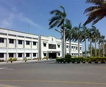

<html lang="en">
<head>
    <meta charset="UTF-8">
    <meta name="viewport" content="width=device-width, initial-scale=1.0">
    <title>Laiba Asif - Mechanical Engineer</title>
    
</head>
<body>
    <header>
        
        <h1>Laiba Asif</h1>
        
Mechanical Engineer | Formula Student Enthusiast | Advocate for Women in STEM

    </header>

    <nav>
        <a href="#about">About</a>
        <a href="#work">Work Experience</a>
        <a href="#education">Education</a>
        <a href="#projects">Projects</a>
        <a href="#skills">Skills</a>
        <a href="#volunteering">Volunteering</a>
    </nav>

    <section id="about">
        <h2>About Me</h2>
        

            As a Mechanical Engineer and Formula Student enthusiast, I am deeply passionate about STEM, particularly in structural and materials engineering. My journey began with a commitment to breaking gender barriers and advocating for diversity in STEM. With a solid foundation in mechanical engineering and hands-on Formula Student experience, I aim to contribute to innovative solutions while championing inclusivity in engineering.
        

        

        
        

    </section>

    <section id="work">
        <h2>Work Experience</h2>
        <h3>Globalink Research Intern - MITACS</h3>
        <ul>
            <li>Conducted research on additive manufacturing of fire-retardant composite structures for lunar conditions.</li>
            <li>Investigated the use of urine as a binder, conducted SEM analysis, and created benchmarking parameters for testing clay flow and lunar regolith.</li>
            <li>Developed optimal slurry composition for 3D printing.</li>
        </ul>
        

            
            
            
        

        <h3>Structure Lead - Formula Electric Racing-NUST (FERN)</h3>
        <ul>
            <li>Achieved 22nd overall position at FSUK 2023 among 66+ teams and 5th in the Cost and Manufacturing Event.</li>
            <li>Designed a rule-compliant chassis and reduced manufacturing time by 30% using custom jigs.</li>
            <li>Fabricated the first in-house Impact Attenuator (IA) and collaborated with suppliers for material imports.</li>
            <li>Promoted Women in STEM through initiatives like a BBC Urdu interview.</li>
        </ul>
        

            
            
Team Formula Electric Racing-NUST at FSUK 2023.

        

        <h3>Technical Intern - Karachi Shipyard</h3>
        <ul>
            <li>Analyzed warehouse operations and suggested improvements for inventory management.</li>
            <li>Observed production processes in fabrication shops and presented findings to a panel.</li>
        </ul>
        

        

    </section>

    <section id="education">
        <h2>Education</h2>
        <h3>National University of Sciences and Technology (NUST)</h3>
        <ul>
            <li>Bachelor of Engineering in Mechanical Engineering (2021 - Present)</li>
            <li>CGPA: 3.84/4.0 (till 6th semester)</li>
            <li>Recipient of Benazir Undergraduate Scholarship Project (full-tuition scholarship).</li>
        </ul>
        

            
            
Beautiful view of NUST's main campus.

        

        <h3>Khatoon-e-Pakistan Govt. Degree College for Women</h3>
        <ul>
            <li>HSC Intermediate (Pre-Engineering) (2019 - 2021)</li>
            <li>Final Grade: 92.4%</li>
        </ul>
    </section>

    <section id="projects">
        <h2>Projects</h2>
        <h3>Radiator Positioning in Formula Student Vehicle</h3>
        
Optimized radiator mass flow and mounting points through CFD analysis using DS SOLIDWORKS and Siemens Star CCM+.

        

        

        <h3>Braking System Design</h3>
        
Designed and simulated a braking system based on Formula Student rules using MATLAB and DS SOLIDWORKS.

        

        

    </section>

    <section id="skills">
        <h2>Skills</h2>
        <ul>
            <li><strong>Technical:</strong> 3D Printing, SEM Analysis, CAD Modeling, ANSYS, Microsoft Office.</li>
            <li><strong>Soft Skills:</strong> Adaptability, Logical Reasoning, Strategic Planning, Public Engagement.</li>
        </ul>
    </section>

    <section id="volunteering">
        <h2>Volunteering</h2>
        <h3>Meal Preparation at Government School</h3>
        
Prepared 500+ meals as part of a SEEK Lab and ASHRAE PNEC Chapter activity in September 2024.

        

            
             
            
Volunteers preparing meals at the government school.

        

        <h3>IEEE-WIE Panel Discussion</h3>
        
Guided junior batches at NUST-PNEC on securing internships and maximizing undergraduate experiences in October 2024.

        

            
            
IEEE-WIE panel discussion on career growth.

        

    </section>

    <footer>
        
© 2024 Laiba Asif | <a href="mailto:laiba.asif162@gmail.com" style="color: white;">Contact Me</a>

    </footer>
</body>
</html>
